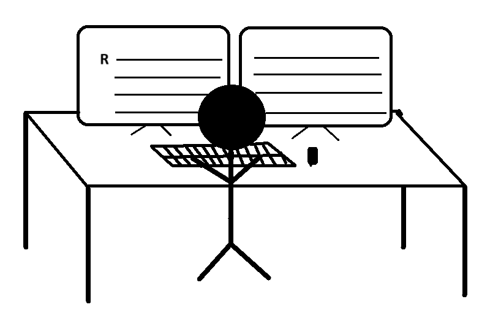

# A Guide for New R Learners

To begin with, everyone who reads this post is welcome to the exciting world of R! Whether you’re a data enthusiast, aspiring data scientist, or curious learner, diving into the R language can be rewarding. To help you navigate this landscape, I’ve compiled a guide with helpful resources available online. Let’s look into these resources together!

## 1. Getting Started with R

- **R Foundation:** Start your journey by visiting the [R Project](https://www.r-project.org/), the official home of the R programming language.
- **R Manuals:** Explore the in-depth manuals available on [CRAN](https://cran.r-project.org/manuals.html) for a detailed understanding of R's foundations.

## 2. Basic Functions and Syntax

- Check out this collection of [cheat sheets](https://posit.co/resources/cheatsheets/) for quick reference to basic R functions.
- Brush up on your R knowledge with practical insights at [Posit Cloud's Recipes](https://posit.cloud/learn/recipes).

## 3. R vs. Python

- Delve into the comparison between R and Python for data professionals with articles from [Medium](https://medium.com/analytics-and-data/r-vs-python-a-comprehensive-guide-for-data-professionals-321e8dead598) and [DataQuest](https://www.dataquest.io/blog/python-vs-r/).

## 4. Free Courses and Practice Platforms

- Learn R interactively with DataQuest's [Data Analyst R Path](https://www.dataquest.io/path/data-analyst-r/).
- Practice your skills on Kaggle's [datasets](https://www.kaggle.com/datasets) and participate in data science [competitions](https://www.kaggle.com/competitions).

## 5. R Studio Essentials

- Discover the advantages of using R Studio as your integrated development environment (IDE) with insights from [The Analysis Factor](https://www.theanalysisfactor.com/the-advantages-of-rstudio/).
- Engage with the R Studio community on [RStudio Community](https://community.rstudio.com/).

## 6. Join the R Community

- Connect with like-minded individuals at local [R User Groups](https://jumpingrivers.github.io/meetingsR/r-user-groups.html) or [R-Ladies](https://www.meetup.com/pro/rladies/) meetups.
- Explore discussions on [R language Reddit](https://www.reddit.com/r/Rlanguage/) and [rOpenSci](https://discuss.ropensci.org/).

## 7. Data Visualization in R

- Master the art of data visualization using ggplot2 with tutorials from [R-Ladies Sydney](https://rladiessydney.org/courses/ryouwithme/03-vizwhiz-1/#1-4-putting-it-all-together-dplyr-ggplot).

## 8. Data Transformation and Tidyverse

- Dive into data transformation techniques with Hadley Wickham's [R for Data Science](https://r4ds.had.co.nz/transform.html) book.
- Familiarize yourself with the [Tidyverse](https://www.tidyverse.org/) collection of R packages.

## 9. R Markdown Mastery

- Learn the art of creating dynamic documents with R Markdown from the official [R Markdown](https://rmarkdown.rstudio.com/lesson-1.html) guide.
- Explore various formats, including dashboards and parameterized reports.

## 10. Explore GitHub Blogs and Bias Function

- Stay updated with the latest trends and insights from GitHub's [blog](https://posit.co/blog/), [Stack Overflow blog](https://stackoverflow.blog/), and [R Bloggers](https://www.r-bloggers.com/).
- Understand bias function usage with the [SimDesign](https://www.rdocumentation.org/packages/SimDesign/versions/2.2/topics/bias) package.

## 11. Ethics in Data Science

- Delve into the ethical aspects of data science with insights from [Data Science Box](https://datasciencebox.org/02-ethics.html).

## 12. Additional Resources and Practice

- Explore open resources like [Bioconductor](https://bioconductor.org/), [R-Forge](https://r-forge.r-project.org/), and [rOpenSci](https://ropensci.org/).

With this guide, you have a roadmap to navigate the vast resources available on the internet. Remember, learning is a continuous process, so dive into the community, practice regularly, and enjoy the journey of mastering the R language. Happy coding!

